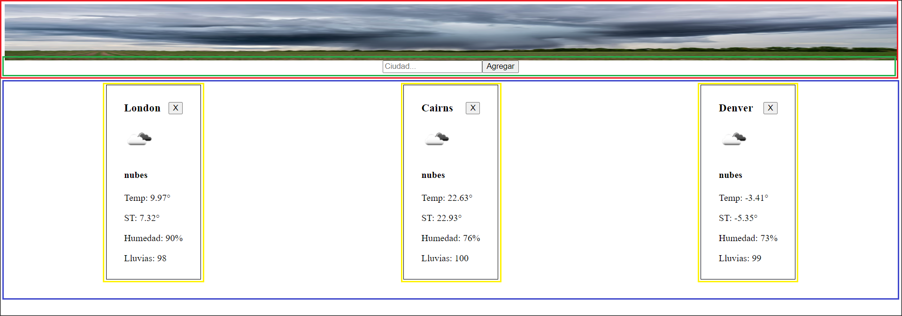
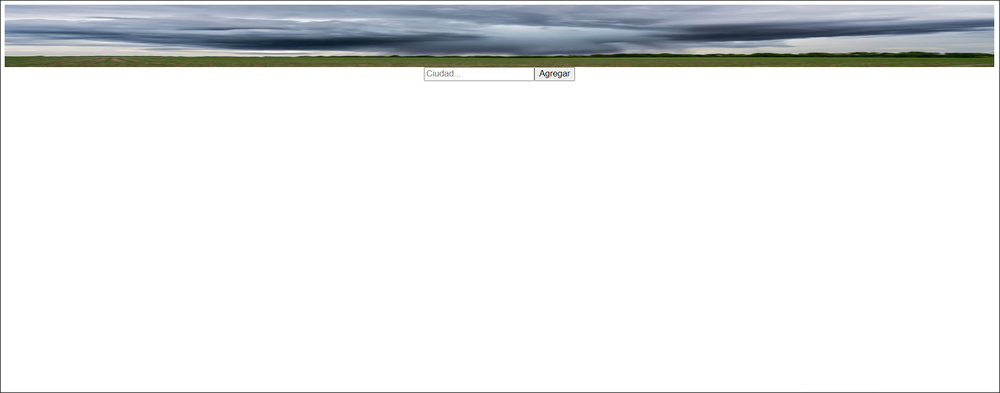

## AclimatADA App

### Ejercicio

Vamos a aplicar algunos conceptos sobre condicionales y eventos.

> **Nota**: Todos los Componentes que hagamos en esta practica son `Puros` y `Funcionales`, por lo tanto, ninguno tiene estado, simplemente reciben datos por props y son funciones.
>
> No te preocupes por el estilo de los componentes. En siguientes practicas implementaremos estilos, utilizaremos algunos estilos en linea por el momento (Las imagenes son puramente ilustrativas).

No es necesario volver a correr el proyecto cada vez que se realice un cambio sino que se verá automáticamente reflejando en el navegador.

> Hay veces que por problemas de configuración los cambios no se ven automáticamente reflejados en el navegador por lo que si te ocurre esto la opción rápida sería refrescar la pagina y si no, parar la ejecición del proyecto (Ctrl + C) y volver a ejecutar `npm run dev`. De todas formas si te ocurre esto contactate con tu Profe o Tutor/Tutora.

### Ejercitación

1. Copiar los componentes creados en el ejercicio anterior dentro de la carpeta `components`.

- Card.jsx
- ContainCard.jsx
- SearchBar.jsx

2. Adicionalmente a los componentes que ya teníamos vamos a tener que crear otro denominado `Nav` que va a ser nuestra barra superior de navegación en la cual debemos incluir el componente `SearchBar`. Escribir el código correspondiente en `components/Nav.jsx`. El resultado debería ser similar a lo siguiente:

<p align="center">
  
</p>

- **Recuadro rojo**: Nav
- **Recuadro verde**: SearchBar

Ahora que ya tenemos cada una de las partes de nuestra aplicación procedamos a unirlas. Para ello veamos una imagen del resultado final y pensemos la estructura general:

<p align="center">
  
</p>

- **Recuadro rojo**: Nav
- **Recuadro verde**: SearchBar
- **Recuadro azul**: ContainCard
- **Recuadro amarillo**: Card

3. Dentro del archivo `App.js` cambiar el contenido si aun no lo hiciste, recordemos en la ejercitacion pasada, modificamos el componente `App.jsx`. Recordar que cada una de las tarjetas del clima (`Card`) están incluidas dentro de un componente superior (`ContainCards`) y que el `SearchBar` se encuentra dentro del `Nav` por lo que solo deberíamos agregar acá los componentes `Nav` y `ContainCard`.

> Nota: Si hiciste la ejercitacion pasada, saltear este punto aclaracion ya que tu ContainCard ya deberia estar correctamente implementado.

- Importar los componentes que vamos a utilizar

```js
// App.js
...

//Importar
import Nav from './components/Nav.jsx';
import ContainCard from './components/ContainCard.jsx';

...
      //Renderizar componentes
      <div>
        <Nav />
        <ContainCard />
      </div>
...

```

Inicialmente si nuestro componente ContainCard no está recibiendo datos de ciudades la aplicación se vería de la siguiente forma:

<p align="center">
  
</p>

4. Pasarle la función `Search` al `Nav`.

Si observamos, por la nueva implementacion del componente `Nav` ahora debemos pasarle la funcion `onSearch` que se encuentra en el componente `App` al componente `Nav`.

```js
<Nav onSearch={onSearch} />
```

5. Quien finalmente debe ejecutar la función `onSearch` no es el `Nav` sino el `SearchBar` por lo que debemos hacerle llegar dicha función.

```js
// Nav.jsx
...
        <SearchBar onSearch={onSearch}/>
...

```

6. En este punto ya la función debería ejecutarse ya que en el ejercicio anterior ya recibiamos la funcion `onSearch` en el componente `SearchBar` y la ejecutabamos al hacer click en el botón `Agregar`.

```js
//SearchBar.jsx

export default function SearchBar({ onSearch }) {
  return (
    <form
      onSubmit={(e) => {
        e.preventDefault();
        onSearch("Cairns");
      }}
    >
      <input type="text" placeholder="Ciudad..." />
      <input type="submit" value="Agregar" />
    </form>
  );
}
```

#### **ContainCard (`components/ContainCard.js`)**

Este Componente va a servir para renderizar muchos Componentes `Cards`. Básicamente, este componente va a recibir un arreglo de `ciudades` (con todos sus datos), y va a crear un componente `Card` por cada ciudad, pasandole las props correspondientes.

> Ahora preguntemonos? Que sucederia si no existieran ciudades? Como deberiamos mostrar el componente? Para ello vamos a utilizar un condicional para mostrar un mensaje en caso de que no existan ciudades. (Ternario)


#### **Card (`components/Card.js`)**

Esta tarjeta va a mostrar los datos de una ciudad con una imagen que representa el estado del clima (soleado, nublado, etc..), además cuando el usuario haga click en la X de cerrar, se invocará una función que tambien viene como prop.


> Aqui debemos nuevamente preguntarnos, que sucederia si no existiera uno o mas datos (Por culpa de la api)? Por ejemplo, si el dato `Humidity` llegara como `Null`? Como deberiamos mostrar el componente? Nos daria un error, para ello vamos a mostrar el texto "Inexistente" en caso de que no exista el dato. (Condicion corta, OR)

> Y si queremos dar un estilo diferente a las tarjetas que tengan una temperatura mayor a 25° o menor a 5°? Para ello, (Nuevamente a modo de practica no se preocupen si se ve bonito o no) mostrar la tarjeta o la temperatura en rojo si es mayor a 25° o en azul si es menor a 5°.

## 7. El desafio en este punto es lograr eliminar correctamente una ciudad del array de ciudades al hacer click en el boton 'X' de la tarjeta. Para ello, debemos pasarle a la funcion onClose, el id de esa ciudad.

<br><br>

### Instrucciones para correr el proyecto

#### `npm install`

Instala todas las dependecias necesarias para correr el proyecto correctamente a la altura del package.json

#### `npm run dev`

Comienza a correr la aplicación de forma local por lo que se puede ver desde el navegador accediendo a
http://127.0.0.1:5173/

> No es necesario volver a correr el proyecto cada vez que se realice un cambio sino que se verá automáticamente reflejando en el navegador. Si se detecta que no se aplica un cambio automaticamente, es recomendable en ese caso actualizar el navegador
